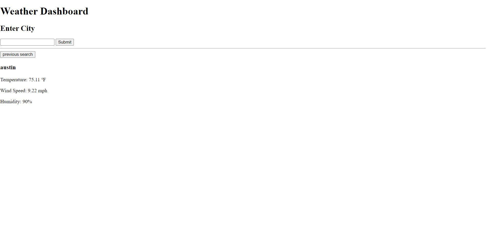

# Weather API

A weather dashboard that will run in the browser and feature dynamically updated HTML and CSS and third party API. 


## User Story

```
AS A traveler
I WANT to view the weather for multiple cities
SO THAT I can plan a trip accordingly
```

## Screenshot 



## Deployed Application 

https://sanmcc.github.io/Wheather-Forcast/ 